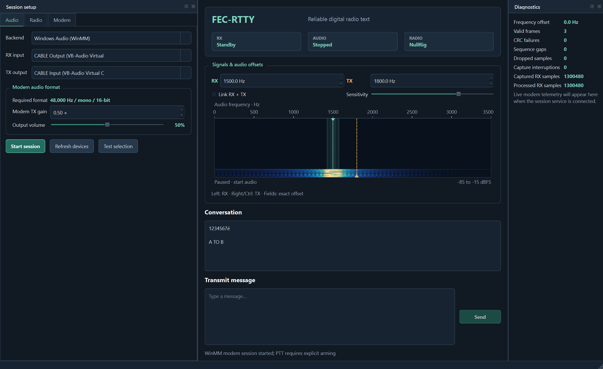

# FEC-RTTY - M0NXD

An experimental amateur-radio text modem with forward error correction (FEC),
a Windows desktop interface and a live audio waterfall. It sends UTF-8 text,
including newlines, as actual modem audio. Messages are unencrypted.

## The 24-hour experiment

FEC-RTTY began as an experiment to build a digital mode in 24 hours: develop
the modem, add FEC and a usable GUI, and demonstrate transmission and decoding
over a real audio path. This was the original challenge, not a claim that all
development or radio validation finished in that time.

## Download and run

Current application: **0.46.1**, experimental Windows x64 CAT/audio build.

- [Windows installer](https://github.com/M0NXD/FEC-RTTY/releases/download/v0.46.1/FEC-RTTY-0.46.1-Setup-x64.exe): installs application runtimes, documentation, Start-menu shortcuts and standard Windows uninstall.
- [Portable Windows ZIP](https://github.com/M0NXD/FEC-RTTY/releases/download/v0.46.1/FEC-RTTY-0.46.1-Windows-x64.zip): extract completely, then run `gui/fectty-gui.exe`.
- [Latest release and checksums](https://github.com/M0NXD/FEC-RTTY/releases/latest): source download, SHA256 checksums and matching Qt library sources.

Requires Windows 10 1809+ or Windows 11 x64 and a suitable 48 kHz audio device.
No Qt SDK, compiler or separate application-runtime installation is needed.
The installer is unsigned; Windows may display an unknown-publisher warning.
Only use packages obtained from this repository's release page. See
[Installation](docs/INSTALLER.md) for repair, uninstall and known deployment limits.

GitHub contains one canonical latest source tree and one current release.
Older development packages are not published here.

## What it provides

- One fixed 50-baud, 48 kHz four-tone FSK mode with convolutional FEC and CRC.
- Direct text transmission and decoding, without link negotiation or ACK waits.
- A resizable Qt GUI, input/output device selection and output-volume control.
- A real RX waterfall with linked or separate RX/TX audio-frequency offsets.
- WinMM/PortAudio audio and a `NullRig / audio only` default.
- Direct Hamlib, rigctld TCP and OmniRig with explicit PTT arming and RF tuning.

Recorded v0.46.0 cable receiver after playback; the sender used Hamlib Dummy
PTT, not a physical radio. Device names and offsets are examples.

This is **not conventional two-tone Baudot RTTY**; a compatible FEC-RTTY
decoder is required. Optional CAT supports direct Hamlib, rigctld TCP and
OmniRig. Arming is off on every launch; see [Radio control](docs/RADIO_CONTROL.md).
`TX complete` means playback (and armed PTT release) finished, not guaranteed reception.

## Test with two windows

Launch `gui/fectty-gui.exe` twice. For a virtual-cable test, install
[VB-CABLE separately](https://vb-audio.com/Cable/), then select `CABLE Output`
for RX and `CABLE Input` for TX in both windows. Keep `NullRig / audio only`,
use matching 1500 Hz offsets and start both sessions. Send A to B, wait for
playback to finish, then test B to A. A shared cable carries both instances'
audio, including their own transmissions; simultaneous sends can collide.

See [GUI operation](docs/GUI_PACKAGE.md) and [Testing](docs/TESTING.md).
Bench results do not establish RF readiness. The virtual-cable driver is
optional and is not included or installed by FEC-RTTY.

## Build from source

Core tools require CMake 3.20+ and a C++20 compiler. The GUI also needs a
compatible Qt 6 SDK/compiler. Development dependencies are not downloaded by
the build helpers.

~~~powershell
git clone https://github.com/M0NXD/FEC-RTTY.git
Set-Location FEC-RTTY
& .\source\build.bat
~~~

This builds/tests the core, **not the GUI**. Follow
[Building from source](docs/BUILDING.md) for GUI dependencies and deployment.

## Documentation

- [Project guide](docs/PROJECT_GUIDE.md): operation, architecture and limitations.
- [Build instructions](docs/BUILDING.md) and [test instructions](docs/TESTING.md).
- [Protocol specification](docs/PROTOCOL.md): waveform, framing, FEC and decoding.
- [GUI operation](docs/GUI_PACKAGE.md), [radio/CAT operation](docs/RADIO_CONTROL.md) and [design requirements](docs/GUI_DESIGN.md).
- [Development roadmap](docs/DEVELOPMENT_PLAN.md).
- [Documentation and test-record index](PROJECT_INDEX.md).

## Limits and licensing

Exact sequential two-way modem-audio decoding has been demonstrated on a
shared Windows virtual cable. Independent radios/computers, long sound-clock
drift, clean-machine deployment and exhaustive accessibility remain unverified.
Stopping RX can abandon queued samples; zero overflow does not prove all
captured samples were processed. See the
[known limitations](docs/PROJECT_GUIDE.md#12-history-and-remaining-work).

The [public-package acceptance](evidence/PUBLIC_RELEASE_20261005.md) records
37 installer assertions and exact two-way text on both audio backends, but also
an intermittent WinMM capture-buffer error. Prefer PortAudio for the cable
bench if that error appears; continuous fault-free WinMM capture is not claimed.

No general application source license has been selected; source visibility is
not an open-source license grant. Qt is dynamically linked under LGPL-3.0;
its license texts, corresponding sources and replacement instructions accompany
the downloads. Those library rights are not restricted by the application.
See [dependency notices](installer/THIRD_PARTY_NOTICES.md) and
[publication policy](docs/PUBLISHING.md).
