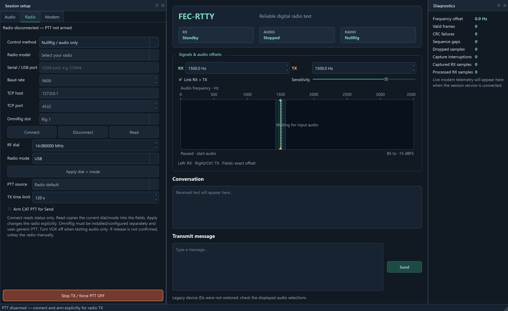

# CAT radio control (0.46.1)

FEC-RTTY began as a 24-hour digital-mode experiment. CAT integration changes
neither the single fixed modem waveform nor its unencrypted messages.
The CLI live audio tool remains an audio-only bench tool.

## Choose a connection

| Method | Configuration | Prerequisites |
|---|---|---|
| NullRig / audio only | No CAT connection | Default for virtual-cable tests |
| Hamlib / direct serial or USB | Exact radio model, COM port, baud rate | Included Hamlib 4.7.2; radio manufacturer's USB driver if needed |
| Hamlib / rigctld TCP | Numeric IP or localhost, port (default 4532) | Separately running/configured rigctld server |
| OmniRig | Rig 1 or Rig 2 | Separately installed/registered OmniRig with the selected slot configured |

Do not let two programs own one direct serial port. Do not assume a discovered
COM port is your radio. OmniRig is an external COM server, not included in the
installer. TCP hostnames other than localhost are rejected; use numeric IPv4/IPv6.
Restrict rigctld to a trusted interface/network.

The TCP method is protocol-based, not process-name-based. Any local service
that exposes the Hamlib NET rigctl protocol can be selected, including CAT4OM's
Hamlib-compatible endpoint. FEC-RTTY accepts both standard plain getter replies
(`f`, `m`, `t`) and Hamlib's extended getter replies (`+f`, `+m`, `+t`).

Recorded idle Radio tab, with NullRig selected and PTT unarmed. Disabled fields
become available when their corresponding connection method is selected.

[OmniRig download/configuration](https://dxatlas.com/OmniRig/) is supplied by
its vendor. A port-busy/offline slot is not a successful connection; free the
configured port and verify the radio's settings before arming. The installer
does not rewrite existing OmniRig profiles.

Choose audio endpoints separately. CAT does not transport modem audio or
automatically select the transceiver's USB/data routing. Disable processing/
compression and start with low output volume while checking radio ALC/drive.
A volume percentage is not a safe-RF-power calibration.

## Connect, read and apply

Connect reads live frequency, mode and RX/TX status; it issues no dial/mode
write or PTT command. Read copies the observed dial/mode into the fields.
Direct Hamlib disables its frontend read cache and rejects models without
frequency, mode or PTT getters before opening a port. Some older radios cannot
report PTT and therefore cannot use this confirmed-state CAT backend. A getter
is not a universal physical-state guarantee: Hamlib model implementations and
rigctld/OmniRig can have their own polling or state limitations. Verify actual
TX/RX behavior on the chosen radio; a software response is not an RF measurement.
Apply dial + mode explicitly writes the RF frequency in MHz and USB, LSB,
Data USB or Data LSB, then confirms matching readback. Unsupported data modes
are not silently changed to ordinary SSB.

Apply can partially change the radio before a fault. Check the physical
controls after any failed command/readback, then reconnect to clear the fault.
OmniRig's signed 32-bit frequency limit is respected; the GUI conservatively
limits all dial fields to 2147.483647 MHz.

Waterfall RX/TX offsets are **audio Hz**, not RF MHz; they never move the
radio dial. The RF carrier/sideband relationship depends on radio settings;
no automatic dial correction is made. Match sender TX and receiver RX centers,
and keep all four tones inside the passband.

## Arm PTT explicitly

Arming is off on every launch and never saved. Saved connection settings do
not automatically open a connection. Verify radio/audio routing before
checking Arm CAT PTT for Send.

Use Radio default unless the radio supports Hamlib's Microphone input or
Data input commands. Unsupported commands fail the send. OmniRig has generic
RX/TX only; microphone/data routing is configured externally.

With armed CAT, Send follows this sequence:

1. Read status; refuse an already transmitting radio, unknown mode,
   disconnected/faulted backend or message exceeding the TX time limit.
2. Issue PTT ON and confirm transmitting readback.
3. Wait the PTT lead (default 150 ms), then stream actual modem audio.
4. Wait for completed playback and the PTT tail (default 100 ms).
5. Issue PTT OFF and confirm RX. Only then report a successful send.

Lead/tail are on the Modem tab. The default maximum keyed time is 120 seconds,
configurable 1–600. Duration checks include acquisition, frame overhead,
audio drain, lead/tail and three seconds' allowance. Oversized messages are
rejected before keying; shorten them or deliberately increase the limit.

Unarmed Send outputs audio only. **VOX, external software or hardware can
still key a radio**; NullRig cannot disable them. For a no-RF test use Hamlib
Dummy and a virtual cable, or physically disconnect the transmitter.

## Stop and failures

Stop session, cancellation and shutdown cancel audio and attempt to release
owned PTT. Stop TX / force PTT OFF also sends a release when FEC-RTTY did not
own PTT; it can interrupt a transmission started elsewhere.

CAT runs on a dedicated worker, not the GUI/audio callback. While keyed,
status is checked about once per second. A software watchdog attempts release
on TX-limit expiry. Faults inhibit further armed sends. Only release is
retried: failed keying is never automatically retried. A lost ON reply is
treated as potentially keyed even if cached status says RX.

Unconfirmed OFF/readback retains uncertain ownership and displays **PTT release
NOT confirmed — unkey the radio manually**. Connection replacement and rekeying
remain inhibited. Restore transport, use force release, verify the physical
radio and manually unkey as necessary. A disconnected cable or closed window
is not proof of RX.

The software watchdog is not a hardware guarantee. Hung driver/COM calls,
transport loss, process termination, power failure or a failing radio can
delay/prevent release. Use the radio's own TX timeout, a physical override and
supervised low-power/dummy-load tests. A crash cannot guarantee PTT OFF.

## Developer verification

Core tests cover worker ownership, readback, fault inhibition, uncertain
key/release, watchdog and settings. Windows tests cover fragmented, negative,
plain and extended rigctld replies, plus negative, malformed and timed-out
cases and fake OmniRig COM dispatch for both
slots and exact RX/TX/data enum values. Direct tests use real Hamlib Dummy ID 1.

Explicit GUI bench flags default to NullRig regardless of saved radio settings.
Automated CAT requires --cat-ptt; --cat-apply-hz deliberately writes dial/mode.
See --help for backend/model/device/baud/TCP/slot/source/lead/tail/limit flags.

~~~text
fectty-gui.exe --autostart --rx none --tx portaudio:N --rig-backend hamlib --rig-model 1 --cat-apply-hz 14080000 --cat-mode USB --cat-ptt --send "CAT TEST" --quit-after-send
~~~

Replace N with a verified cable output. This uses simulated CAT but real audio.
tools/test-gui-cat.ps1 checks seven loopback GUI normal/failure cases, including
zero generated modem samples on failed keying. tools/test-gui-direct.ps1
-CatDummy checks exact two-window audio decoding.

These tests do not validate physical radios, every Hamlib model, an actual
OmniRig installation/driver, transceiver routing, independent clocks or RF.
See [recorded CAT acceptance](../evidence/CAT_RELEASE_20261005.md) and
[Testing](TESTING.md) for results and remaining limits.
